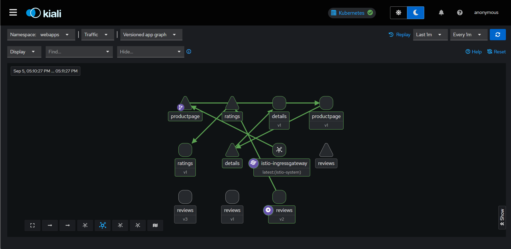

# Canary Deployment with Istio Service Mesh

This project demonstrates advanced canary deployment strategies using Istio service mesh with the Bookinfo sample application. It showcases traffic splitting, gradual rollouts, A/B testing, and comprehensive observability through integrated monitoring tools.

## Table of Contents

- [Overview](#overview)
- [Architecture](#architecture)
- [Prerequisites](#prerequisites)
- [Project Structure](#project-structure)
- [Quick Start](#quick-start)
- [Canary Deployment Strategies](#canary-deployment-strategies)
- [Monitoring and Observability](#monitoring-and-observability)
- [Advanced Configurations](#advanced-configurations)
- [Troubleshooting](#troubleshooting)
- [Contributing](#contributing)

## Overview

This project provides a complete implementation of canary deployment patterns using Istio service mesh capabilities. The Bookinfo application serves as a microservices example with multiple service versions, allowing you to practice various deployment strategies including:

- **Traffic Splitting**: Gradually shift traffic between service versions
- **A/B Testing**: Route specific users to different service versions
- **Blue-Green Deployment**: Switch traffic between stable and new versions
- **Gradual Rollout**: Incrementally increase traffic to new versions
- **Rollback Strategies**: Quick reversion to previous stable versions

## Architecture

The project consists of several key components:

```
┌───────────────────────────────────────────────────────────────────┐
│                        Istio Service Mesh                         │
├───────────────────────────────────────────────────────────────────┤
│  ┌─────────────┐  ┌─────────────┐  ┌─────────────┐  ┌─────────┐   │
│  │ Productpage │  │   Reviews   │  │   Details   │  │ Ratings │   │
│  │   (v1)      │  │ (v1,v2,v3)  │  │   (v1,v2)   │  │ (v1,v2) │   │
│  └─────────────┘  └─────────────┘  └─────────────┘  └─────────┘   │
├───────────────────────────────────────────────────────────────────┤
│                    Traffic Management Layer                       │
│  ┌─────────────────────────────────────────────────────────────┐  │
│  │  Virtual Services │ Destination Rules │ Gateways │ Policies │  │
│  └─────────────────────────────────────────────────────────────┘  │
├───────────────────────────────────────────────────────────────────┤
│                    Observability Stack                            │
│  ┌─────────────┐  ┌─────────────┐  ┌─────────────┐  ┌─────────┐   │
│  │ Prometheus  │  │   Grafana   │  │   Kiali     │  │ Jaeger  │   │
│  │ (Metrics)   │  │(Dashboards) │  │(Topology)   │  │(Traces) │   │
│  └─────────────┘  └─────────────┘  └─────────────┘  └─────────┘   │
└───────────────────────────────────────────────────────────────────┘
```

### Service Components

- **Productpage**: Frontend service written in Python/Flask
- **Reviews**: Backend service with multiple versions (v1, v2, v3) written in Java
- **Details**: Book details service written in Ruby
- **Ratings**: Rating service written in Node.js with database backends

## Prerequisites

Before starting, ensure you have the following installed and configured:

- **Kubernetes Cluster** (v1.20+)
- **Istio Service Mesh** (v1.20+)
- **kubectl** configured to access your cluster
- **Docker** for building custom images (optional)
- **Helm** (v3.0+) for addon installations

### Istio Installation

If Istio is not already installed, follow these steps:

```bash
# Download Istio
curl -L https://istio.io/downloadIstio | sh -
cd istio-*
export PATH=$PWD/bin:$PATH

# Install Istio with demo profile
istioctl install --set values.defaultRevision=default
kubectl label namespace default istio-injection=enabled
```

## Project Structure

```
canary-deploy-isito/
├── addons/                          # Monitoring and observability addons
│   ├── prometheus.yaml             # Prometheus metrics collection
│   ├── grafana.yaml                # Grafana dashboards
│   ├── jaeger.yaml                 # Distributed tracing
│   ├── kiali.yaml                  # Service mesh visualization
│   ├── loki.yaml                   # Log aggregation
│   └── extras/                     # Additional monitoring tools
│       ├── prometheus-operator.yaml
│       ├── skywalking.yaml
│       └── zipkin.yaml
├── bookinfo/                       # Bookinfo sample application
│   ├── src/                        # Source code for all services
│   │   ├── productpage/            # Python Flask frontend
│   │   ├── reviews/                # Java Spring Boot service
│   │   ├── details/                # Ruby Sinatra service
│   │   ├── ratings/                # Node.js service
│   │   └── mongodb/                # Database configurations
│   ├── platform/kube/              # Kubernetes manifests
│   │   ├── bookinfo.yaml          # Main application deployment
│   │   ├── bookinfo-*.yaml         # Variant configurations
│   │   └── cleanup.sh              # Cleanup scripts
│   ├── networking/                 # Istio traffic management
│   │   ├── bookinfo-gateway.yaml  # Gateway configuration
│   │   ├── virtual-service-*.yaml # Traffic routing rules
│   │   └── destination-rule-*.yaml # Service subsets
│   ├── policy/                     # Security policies
│   └── gateway-api/                # Gateway API configurations
├── canary-manifests/               # Canary deployment configurations
│   ├── virtual-service.yaml       # Traffic splitting rules
│   ├── destination-rule.yaml      # Service version subsets
│   └── strict-mtls.yaml          # Security policies
└── README.md
```

## Quick Start

### 1. Deploy the Bookinfo Application

```bash
# Deploy the base application
kubectl apply -f bookinfo/platform/kube/bookinfo.yaml

# Verify all pods are running
kubectl get pods
```

Expected output:

```
NAME                              READY   STATUS    RESTARTS   AGE
details-v1-79f774bdb9-6v6n8      2/2     Running   0          1m
productpage-v1-6b746f74dc-8h8z9   2/2     Running   0          1m
ratings-v1-b6994bb9-8f4n5         2/2     Running   0          1m
reviews-v1-545db77b95-8d5v9       2/2     Running   0          1m
reviews-v2-7bf8c9648b-5b8zc       2/2     Running   0          1m
reviews-v3-84779c7bbc-56wpf       2/2     Running   0          1m
```

### 2. Configure Traffic Management

```bash
# Apply destination rules to define service subsets
kubectl apply -f bookinfo/networking/destination-rule-all.yaml

# Apply virtual service for traffic routing
kubectl apply -f bookinfo/networking/virtual-service-all-v1.yaml

# Configure gateway for external access
kubectl apply -f bookinfo/networking/bookinfo-gateway.yaml
```

### 3. Deploy Monitoring Stack

```bash
# Deploy all monitoring addons
kubectl apply -f addons/

# Verify addon deployments
kubectl get pods -n istio-system
```

### 4. Access the Application

```bash
# Get the external IP of the Istio gateway
kubectl get svc istio-ingressgateway -n istio-system

# Access the application (replace EXTERNAL-IP with actual IP)
curl -s "http://EXTERNAL-IP/productpage" | grep -o "<title>.*</title>"
```

## Canary Deployment Strategies

### 1. Traffic Splitting (90/10)

Gradually introduce a new version with 10% traffic:

```bash
# Apply 80/20 traffic split
kubectl apply -f bookinfo/networking/virtual-service.yaml
```

### 2. Equal Traffic Distribution (50/50)

Split traffic equally between versions:

```bash
# Apply 50/50 traffic split
kubectl apply -f bookinfo/networking/virtual-service-reviews-50-v3.yaml
```

### 3. User-Based Routing (A/B Testing)

Route specific users to different versions:

```bash
# Apply user-based routing
kubectl apply -f bookinfo/networking/virtual-service-reviews-jason-v2-v3.yaml
```

This configuration routes users with the "jason" cookie to version v2, while others go to v3.

### 4. Gradual Rollout Strategy

Implement a progressive rollout:

```bash
# Step 1: Start with 10% traffic to new version
kubectl apply -f bookinfo/networking/virtual-service-reviews-90-10.yaml

# Step 2: Increase to 50% after monitoring
kubectl apply -f bookinfo/networking/virtual-service-reviews-50-v3.yaml

# Step 3: Full rollout to 100%
kubectl apply -f bookinfo/networking/virtual-service-reviews-v3.yaml
```

### 5. Rollback Strategy

Quickly revert to previous version:

```bash
# Rollback to stable version
kubectl apply -f bookinfo/networking/virtual-service-reviews-v1.yaml
```

## Monitoring and Observability

### Prometheus Metrics

Prometheus collects metrics from all services and the Istio control plane:

```bash
# Access Prometheus UI
kubectl port-forward -n istio-system svc/prometheus 9090:9090
```

Key metrics to monitor:

- Request rate and error rate
- Response time percentiles
- Service availability
- Resource utilization

### Grafana Dashboards

Grafana provides pre-configured dashboards for Istio:

```bash
# Access Grafana UI
kubectl port-forward -n istio-system svc/grafana 3000:3000
```

Available dashboards:

- **Mesh Dashboard**: Overview of all services
- **Service Dashboard**: Detailed service metrics
- **Workload Dashboard**: Workload-specific metrics
- **Performance Dashboard**: Resource usage monitoring
- **Control Plane Dashboard**: Istio control plane health

### Kiali Service Mesh Visualization

Kiali provides a graphical representation of your service mesh:

```bash
# Access Kiali UI
kubectl port-forward -n istio-system svc/kiali 20001:20001
```

Features:

- Service topology visualization
- Traffic flow analysis
- Configuration validation
- Distributed tracing integration



### Jaeger Distributed Tracing

Jaeger provides end-to-end request tracing:

```bash
# Access Jaeger UI
kubectl port-forward -n istio-system svc/jaeger 16686:16686
```

Trace analysis helps with:

- Request flow visualization
- Performance bottleneck identification
- Error root cause analysis
- Service dependency mapping

## Advanced Configurations

### Custom Canary Manifests

The `canary-manifests/` directory contains custom configurations for canary deployments:

```yaml
# canary-manifests/virtual-service.yaml
apiVersion: networking.istio.io/v1beta1
kind: VirtualService
metadata:
  name: reviews
  namespace: webapps
spec:
  hosts:
    - reviews
  http:
    - route:
        - destination:
            host: reviews
            subset: v1
          weight: 0
        - destination:
            host: reviews
            subset: v3
          weight: 0
        - destination:
            host: reviews
            subset: v2
          weight: 100
```

### Database Integration

The project supports multiple database backends:

```bash
# Deploy with MySQL backend
kubectl apply -f bookinfo/platform/kube/bookinfo-mysql.yaml
kubectl apply -f bookinfo/networking/virtual-service-ratings-mysql.yaml

# Deploy with MongoDB backend
kubectl apply -f bookinfo/platform/kube/bookinfo-mongodb.yaml
```

### Security Policies

Implement mTLS and authorization policies:

```bash
# Enable strict mTLS
kubectl apply -f canary-manifests/strict-mtls.yaml

# Apply authorization policies
kubectl apply -f bookinfo/policy/
```

### Fault Injection Testing

Test service resilience with fault injection:

```bash
# Inject delays
kubectl apply -f bookinfo/networking/virtual-service-ratings-test-delay.yaml

# Inject aborts
kubectl apply -f bookinfo/networking/virtual-service-ratings-test-abort.yaml
```

## Troubleshooting

### Common Issues

#### 1. Pods Not Starting

```bash
# Check pod status
kubectl get pods
kubectl describe pod <pod-name>

# Check logs
kubectl logs <pod-name> -c <container-name>
```

#### 2. Traffic Not Routing Correctly

```bash
# Verify virtual service configuration
kubectl get virtualservice
kubectl describe virtualservice <vs-name>

# Check destination rules
kubectl get destinationrule
kubectl describe destinationrule <dr-name>
```

#### 3. Monitoring Not Working

```bash
# Check addon deployments
kubectl get pods -n istio-system

# Verify service endpoints
kubectl get svc -n istio-system
```

#### 4. Gateway Access Issues

```bash
# Check gateway configuration
kubectl get gateway
kubectl describe gateway bookinfo-gateway

# Verify ingress gateway
kubectl get svc istio-ingressgateway -n istio-system
```

### Debugging Commands

```bash
# Check Istio configuration
istioctl analyze

# Verify proxy configuration
istioctl proxy-config cluster <pod-name>

# Check service mesh status
istioctl proxy-status

# View Envoy configuration
kubectl exec <pod-name> -c istio-proxy -- pilot-agent request GET /config_dump
```

### Performance Optimization

1. **Resource Limits**: Set appropriate CPU and memory limits
2. **Connection Pooling**: Configure connection pool settings
3. **Circuit Breakers**: Implement circuit breaker patterns
4. **Caching**: Add caching layers where appropriate

## Contributing

We welcome contributions to improve this canary deployment example. Please follow these guidelines:

1. Fork the repository
2. Create a feature branch
3. Make your changes
4. Add tests if applicable
5. Submit a pull request

### Development Setup

```bash
# Clone the repository
git clone <repository-url>
cd canary-deploy-isito

# Build custom images (optional)
cd bookinfo/src
./build-services.sh

# Deploy with custom images
kubectl apply -f platform/kube/bookinfo.yaml
```

## Additional Resources

- [Istio Documentation](https://istio.io/docs/)
- [Kubernetes Documentation](https://kubernetes.io/docs/)
- [Prometheus Documentation](https://prometheus.io/docs/)
- [Grafana Documentation](https://grafana.com/docs/)
- [Kiali Documentation](https://kiali.io/documentation/)
- [Jaeger Documentation](https://www.jaegertracing.io/docs/)

## License

This project is licensed under the Apache License 2.0. See the [LICENSE](LICENSE) file for details.

---

For questions or support, please open an issue in the repository or contact the maintainers.
